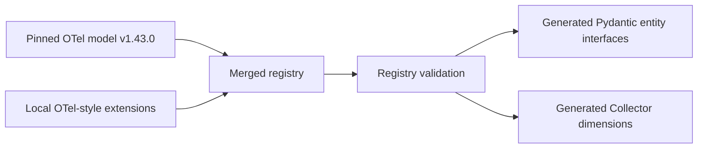
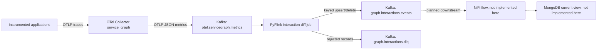

# Architecture

## Purpose And Status

This project turns OpenTelemetry telemetry into a typed, current view of
service interactions and the semantic entities participating in them. A raw
attribute such as `k8s.pod.uid` is useful, but a generated `K8sPod` interface
with a stable entity ID is much more useful to graph, insight, and dependency
systems.

The v1 interaction diff engine is implemented and verified locally. Internal
artifact configuration, deployment integration, and operational certification
remain environment-owned work. See [Limitations and roadmap](limitations-and-roadmap.md)
for the exact boundary.

## System Flows

The semantic build flow creates the contracts used at runtime:

The runtime flow materializes live observed interactions:

Service-graph observations represent recently observed traffic. They are not
a complete or authoritative inventory of all infrastructure entities.

## Semantic Registry

### Upstream And Extensions

The repository pins an OpenTelemetry semantic-convention model snapshot under
`upstream/otel-semconv/v1.43.0/model`. Project-owned attributes, entities, and
relationships use the same OTel model YAML shape under `model/extensions`.
There is no second proprietary registry format.

The registry loader parses the YAML into strict Pydantic models. Validation
rejects duplicate definitions, unresolved attribute references, invalid
relationships, and attempts to redefine upstream-owned semantics. The pinned
artifact and generated package metadata are recorded in
`otel-semconv.lock.json`.

### Generated Entity Interfaces

`scripts/generate_entities.py` merges the pinned upstream model and local
extensions, then emits immutable Pydantic classes such as `K8sPod`, `K8sNode`,
`Service`, and `AppEndpoint`. Each class:

- exposes named semantic fields rather than a generic attribute dictionary;
- parses supported values at the telemetry boundary;
- rejects unknown constructor fields;
- preserves semantic attribute aliases;
- computes a stable, type-qualified entity ID; and
- remains usable without PyFlink or a Kafka client installed.

`entities_from_attributes` can create multiple entity objects from one set of
telemetry attributes. This is deliberate: one resource may identify a service,
service instance, pod, container, node, process, runtime, and telemetry SDK at
the same time.

### Relationships And Dimensions

Project relationships describe structural and dependency semantics such as
`contains`, `runs`, `uses`, `calls`, `publishes_to`, and `queries`. Each
relationship declares the source signals from which it may be inferred.

Collector service-graph dimensions are generated only from scalar attributes
used by entities participating in a `service_graph` relationship. Template
attributes ending in `.label`, `.annotation`, or `.selector` are excluded by
default. This policy keeps graph identity connected to modeled semantics and
avoids turning arbitrary telemetry into unbounded metric dimensions.

## Runtime Components

### OpenTelemetry Collector

The Collector receives OTLP traces and the `service_graph` connector pairs
client and server spans. It exports the resulting metrics as OTLP JSON to
Kafka. The `memory_limiter` is first in each processor chain, service-graph
metrics are batched below the Kafka default message-size boundary, and the
production starting point uses a persistent exporter queue.

The connector is stateful. The standalone Collector chart therefore deploys a
stateless routing tier that hashes by trace ID and sends traces to exactly two
service-graph Collector StatefulSet replicas. Routers use stable ordinal DNS
names behind a headless Service as their static hash ring; a backend restart
does not replace its logical routing identity. The older raw OpenShift
manifest still uses one replica as a reference baseline. See
[Deployment and operations](deployment-and-operations.md#implemented-scaled-collector-design).

### Kafka

Kafka is the durable boundary between extraction, state computation, and
materialization. The application uses the Flink Kafka connector as a normal
Kafka client. It does not use or require Kafka Connect.

| Topic | Producer | Consumer | Key |
|---|---|---|---|
| `otel.servicegraph.metrics` | Collector | Flink job | Collector-defined input key |
| `graph.interactions.events` | Flink job | NiFi, planned | `interaction_id` |
| `graph.interactions.dlq` | Flink job | Operations | deterministic rejection key |

The output key keeps all transitions for one interaction partition ordered.
Topic creation, retention, replication, quotas, and ACLs remain Kafka-platform
responsibilities.

### Semantic Library

The `extended-opentelemetry-semconv` package owns registry parsing, generated
entities, relationships, service-graph dimension policy, OTLP parsing, typed
interaction contracts, canonical hashing, and pure state transitions. It does
not import PyFlink, Kafka clients, or environment settings.

This boundary allows domain behavior to be tested as ordinary Python and lets
other applications reuse semantic entities without installing the Flink
runtime.

### Flink Application

The `otel-servicegraph-diff` package owns environment configuration and PyFlink
wiring. Its pipeline performs these steps:

1. Read OTLP JSON metric envelopes from Kafka.
2. Parse each supported datapoint independently.
3. Send malformed or structurally invalid records to the DLQ.
4. Assign event timestamps and bounded-out-of-orderness watermarks.
5. Key observations by canonical `interaction_id`.
6. Apply the pure interaction state transition.
7. Persist serialized `InteractionState` in keyed `ValueState`.
8. Emit keyed upsert or delete events only for semantic state transitions.

Operator UIDs are stable so checkpoints and savepoints can address the same
logical operators across compatible releases.

### Java Serializers

PyFlink emits a two-field `Row(key, value)`. The two small Java serializers map
the first field to the Kafka record key and the second to the record value.
They contain no semantic or diff logic and are not Kafka Connect plugins.

The serializers exist because PyFlink 2.2.1 does not expose an equally direct,
well-typed Python API for separate Kafka key and value serialization. They are
compiled for Java 11 and loaded from the Flink runtime filesystem.

## Interaction Contracts

### Supported Input

The first diff engine consumes number datapoints from:

- `traces_service_graph_request_total`
- `traces_service_graph_request_failed_total`

Known, unsupported `traces_service_graph_*` metrics are ignored. Malformed
JSON, missing or invalid timestamps, and envelopes that are not valid
service-graph input are rejected to the DLQ. Histogram latency metrics are not
merged into v1 state.

An `InteractionObservation` contains the canonical key, metric name and value,
aggregation temporality, counter start time, observation time, typed client and
server endpoints, connection type, dimensions, and semantic entity references.

### Identity

`interaction_id` is the SHA-256 digest of canonical JSON containing:

- client service name;
- server service name;
- connection type; and
- normalized, sorted service-graph dimensions.

Metric name and metric value are excluded. Consequently, request-total and
failed-total datapoints for the same endpoints and dimensions update one
interaction. Attribute ordering cannot change the ID, while an
identity-relevant dimension change creates another interaction.

### State And Counter Rules

`InteractionState` stores first and last observation times, semantic entities,
dimensions, metrics by name, payload hash, and expiry time. State updates obey
these rules:

- an older observation cannot regress current state;
- a non-zero delta datapoint advances state;
- an unchanged cumulative value with the same counter start time does not
  refresh expiry or emit another event;
- a changed cumulative value advances state; and
- a changed counter start time is treated as a counter reset and advances
  state.

Suppressing unchanged cumulative exports is essential: otherwise periodic
Collector exports could keep a dead interaction alive indefinitely.

### Expiry

The default business TTL is 300 seconds and allowed lateness is 60 seconds.
Each accepted transition replaces its prior timers:

- an event-time timer implements telemetry-time expiry;
- a processing-time timer prevents idle partitions from blocking deletion;
- Flink state TTL, default 24 hours, is defensive cleanup and does not define
  the event contract.

Expiry clears state and emits one delete event. A later observation creates a
new upsert. For observations behind the watermark, expiry is based on the later
of observation time and current watermark.

### Events

Both event variants use schema version `1.0` and event type
`interaction_state_changed`.

An upsert includes `payload_hash` and the full current interaction payload. A
delete sets both `payload_hash` and `interaction` to null. `event_id` is a
deterministic SHA-256 digest of operation, interaction ID, observation time,
and payload hash.

The Kafka sink uses `AT_LEAST_ONCE`. Downstream consumers must therefore:

- upsert and delete by `interaction_id`;
- accept repeated identical `event_id` values as redelivery; and
- reject or alert on conflicting payloads for one `event_id`.

Schema changes that alter field meaning or remove fields require a new schema
version. Additive compatible fields may remain within the current major schema
only after downstream consumers are confirmed to tolerate them.

## Architecture Decisions

| Decision | Reason | Consequence |
|---|---|---|
| Use OTel model YAML | Preserve upstream conventions and tooling concepts | Extensions must follow OTel ownership and reference rules |
| Generate strict Pydantic entities | Provide meaningful interfaces and boundary parsing | Generated code is committed and checked for drift |
| Limit dimensions to modeled entity fields | Control cardinality and retain semantic meaning | Arbitrary telemetry attributes do not affect identity |
| Use Flink keyed state instead of Postgres | Co-locate diff state with stream processing | Checkpoints and state sizing become operational requirements |
| Keep domain logic independent of PyFlink | Make behavior reusable and testable | Infrastructure adapters translate at package boundaries |
| Use event time with processing-time fallback | Respect telemetry time without leaking idle state | Both timer paths must remain behaviorally equivalent |
| Use at-least-once plus deterministic IDs | Match Flink/Kafka behavior without distributed transactions | Downstream materialization must be idempotent |
| Keep Java limited to serialization adapters | Preserve keyed Kafka records from PyFlink | Runtime image includes a small Java 11 JAR |
| Keep Kafka external | Fit managed organizational Kafka | The project creates no broker, Connect, or cluster configuration in production |

## Related Documentation

- [Air-gapped build and release](build-and-release.md)
- [Deployment and operations](deployment-and-operations.md)
- [Limitations and roadmap](limitations-and-roadmap.md)
