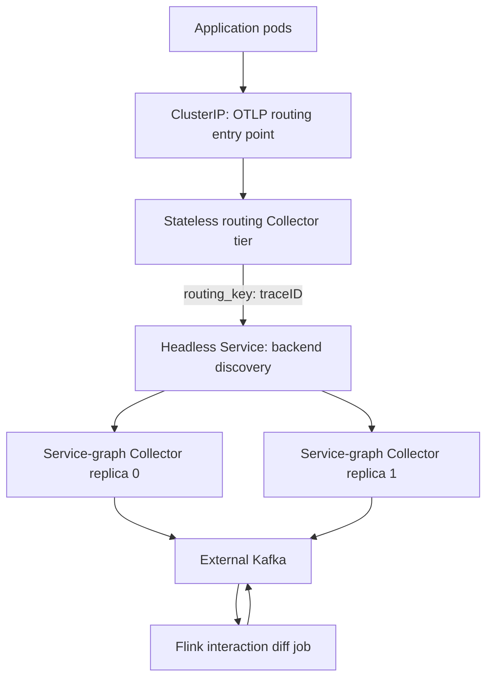
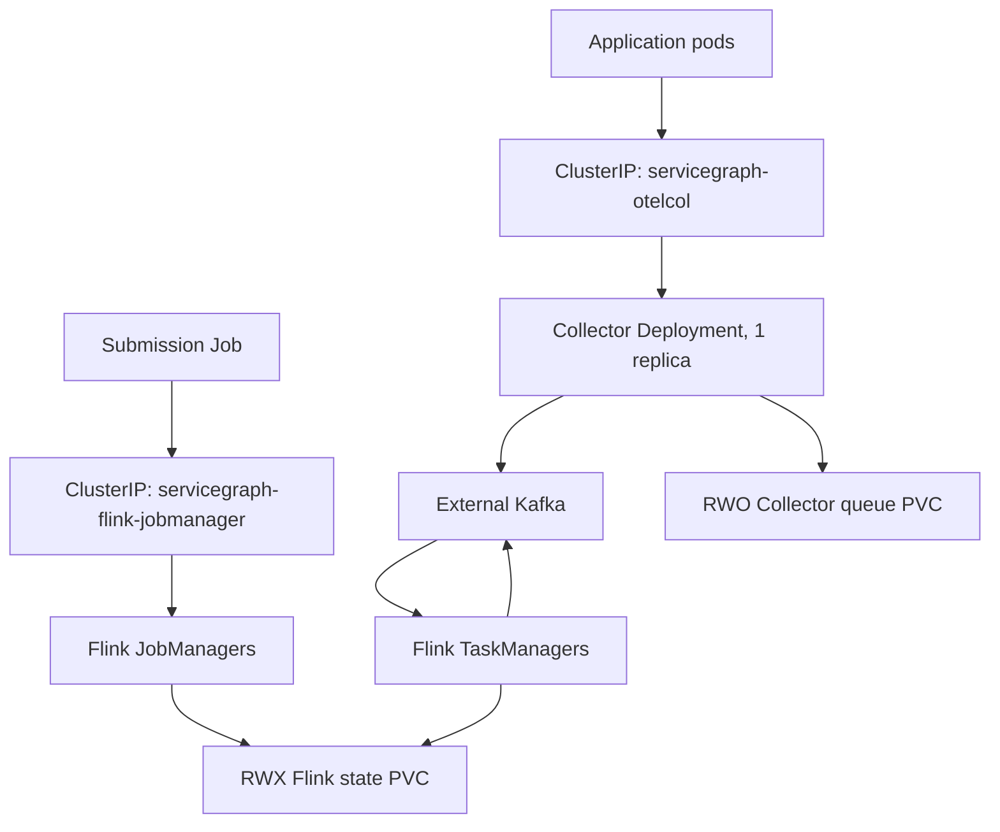
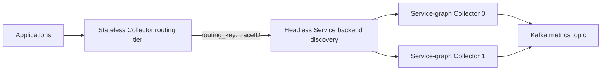

# Deployment And Operations

## Deployment Status

The standalone Collector Helm chart implements the production topology: two
stateless trace-ID routers feed exactly two stateful service-graph Collector
replicas addressed by stable ordinal DNS behind a headless Service. The chart
uses standard namespace-scoped Kubernetes APIs and requires no CRDs,
ClusterRole, Route, Flink operator, or cluster-admin permission.

Internal image references, Kafka/TLS settings, storage classes, NetworkPolicy
selectors/CIDRs, and operational validation are still required before
production. The older raw OpenShift resources remain a single-replica reference
baseline; they are not the recommended Collector deployment. See
[Limitations and roadmap](limitations-and-roadmap.md).

## Implemented Scaled Collector Design

The headless Service provides stable StatefulSet DNS, but does not provide
stickiness by itself. Every router uses `routing_key: traceID` and the same
static ring of two ordinal DNS names. A backend restart therefore retains its
logical ring identity; router queues and retries continue targeting that name
while it recovers. The values schema fixes the first production version at
exactly two service-graph Collector replicas.

This design is implemented by the standalone Helm chart under
`deploy/helm/servicegraph-collector`. Compose uses the same split with the
stable local names `otelcol-backend-0` and `otelcol-backend-1`; kind deploys the
actual chart.

## Legacy Raw Manifest Topology

### Legacy Collector

The raw `deploy/openshift` Collector deployment has one replica and uses `Recreate`. Its
ordinary `ClusterIP` service exposes OTLP gRPC 4317 and OTLP HTTP 4318. The
single replica preserves correct trace pairing, but it is now only a
single-replica reference baseline. New deployments should use the standalone
chart.

Both chart backend and legacy Collector configurations keep `memory_limiter`
first, batch traces and metrics, export service-graph metrics through Kafka
with retries, and store
each persistent sending queue on a dedicated `ReadWriteOnce` volume. The chart
uses one volume claim per StatefulSet replica. File storage must never be
shared between Collector processes or placed on an unsafe shared filesystem.

### Flink

The starting point defines JobManager and TaskManager deployments, a stable
JobManager `ClusterIP` service, probes, resource requests and limits, topology
spread constraints, and disruption budgets. Flink native Kubernetes HA uses
namespace-scoped ConfigMaps through the `servicegraph-flink` service account.

The example configuration uses a shared `ReadWriteMany` PVC for HA metadata,
checkpoints, and savepoints. The internal platform team must confirm that its
storage implementation provides the consistency, durability, throughput, and
concurrent access required by Flink. Object storage or the existing internal
HA chart may replace this baseline without changing domain logic.

### Security

Workloads run as non-root with runtime-default seccomp, no privilege
escalation, all Linux capabilities dropped, and read-only root filesystems.
Writable logs, temporary files, queue data, state, and application artifacts
must be explicitly mounted.

The Collector does not mount a service-account token. Flink mounts its token
only because native Kubernetes HA must manage namespaced ConfigMaps. RBAC grants
that service account only ConfigMap operations in its namespace.

NetworkPolicies allow required in-namespace traffic and explicit egress. DNS
names cannot be selected by standard egress NetworkPolicy, so mock Kafka and
Kubernetes API CIDRs must be replaced with stable, platform-approved values.

## Deployment Modes

### Docker Compose

Compose is the fastest complete developer path. The `otelcol` service is the
public router, and `otelcol-backend-0` plus `otelcol-backend-1` run the stateful
connectors. Redpanda, Flink, and the test producer complete the full local
lifecycle. Compose service names are the static backend identities.

### Kind

Kind exercises the Kubernetes objects rather than Compose approximations.
`scripts/kind_up.ps1` creates a disposable cluster, loads pre-existing local
images, deploys a Redpanda fixture, and installs the exact standalone chart.
`scripts/kind_smoke.ps1` sends paired spans through the router and confirms a
request-total service-graph metric reaches Kafka. Neither script downloads
tools or images implicitly, which keeps the workflow usable with internal
mirrors.

### OpenShift

The Collector is a release independent from the Flink release. Apply the
credential-free stream values contract, then layer organization-owned image,
Kafka, TLS, storage, DNS, and NetworkPolicy values. The chart creates only
namespace-scoped resources and does not mount a service-account token.
`values-openshift.example.yaml` contains deliberately invalid placeholders and
must not be deployed unchanged.

## External Kafka

Production Kafka is external and unchanged by this project. Kafka Connect is
not required. The Kafka platform must create these topics before application
startup:

- `otel.servicegraph.metrics`
- `graph.interactions.events`
- `graph.interactions.dlq`

The baseline assumes three partitions per topic and disables topic
auto-creation. The platform team owns replication, retention, quotas, broker
limits, ACLs, and availability. Application ACLs require Collector write access
to the input topic and Flink read/write access to the input, output, and DLQ
topics plus consumer-group access.

The OpenShift example uses `SASL_SSL`, `SCRAM-SHA-256`, broker hostname
verification, and a mounted PEM CA certificate. Secrets must be created outside
Git with `username`, `password`, and `ca.crt` keys.

The Collector and Flink releases share
`deploy/contracts/servicegraph-stream.values.yaml`. This file contains brokers,
security mode, Secret/key names, and all three topic names, but no credentials.
The Collector chart consumes it directly. The Flink release maps the same
values into `InteractionDiffConfig` environment variables. This contract keeps
the releases independent without allowing their transport settings to drift.

## Runtime Configuration

`InteractionDiffConfig` is the source of truth. Settings are immutable and
reject unknown or inconsistent values.

| Environment variable | Default | Constraint and purpose |
|---|---|---|
| `KAFKA_BOOTSTRAP_SERVERS` | `kafka:9092` | Non-empty comma-separated broker addresses |
| `KAFKA_SECURITY_PROTOCOL` | `PLAINTEXT` | `PLAINTEXT` or `SASL_SSL` |
| `KAFKA_SASL_MECHANISM` | unset | Must be `SCRAM-SHA-256` and is required with `SASL_SSL` |
| `KAFKA_SASL_USERNAME` | unset | Required with `SASL_SSL`; supplied from a Secret |
| `KAFKA_SASL_PASSWORD` | unset | Required with `SASL_SSL`; represented as a secret value |
| `KAFKA_SSL_CA_FILE` | unset | Required PEM CA path with `SASL_SSL` |
| `KAFKA_SSL_ENDPOINT_IDENTIFICATION_ALGORITHM` | `https` | Hostname verification; only `https` is accepted |
| `INTERACTION_DIFF_INPUT_TOPIC` | `otel.servicegraph.metrics` | OTLP JSON service-graph metrics topic |
| `INTERACTION_DIFF_OUTPUT_TOPIC` | `graph.interactions.events` | Keyed interaction upsert/delete topic |
| `INTERACTION_DIFF_DLQ_TOPIC` | `graph.interactions.dlq` | Rejected-input topic |
| `INTERACTION_DIFF_GROUP_ID` | `interaction-diff-engine` | Kafka consumer group |
| `INTERACTION_DIFF_TTL_SECONDS` | `300` | Positive business staleness interval |
| `INTERACTION_DIFF_ALLOWED_LATENESS_SECONDS` | `60` | Non-negative watermark out-of-orderness allowance |
| `INTERACTION_DIFF_STATE_TTL_SECONDS` | `86400` | Must exceed business TTL plus allowed lateness |
| `FLINK_CHECKPOINT_INTERVAL_MS` | `30000` | At least 1000 ms |
| `FLINK_PARALLELISM` | `3` | Positive job parallelism; coordinate with topic partitions and slots |
| `FLINK_RESTART_ATTEMPTS` | `3` | Non-negative fixed-delay restart attempts |
| `FLINK_RESTART_DELAY_SECONDS` | `10` | Non-negative delay between restart attempts |

Authentication values are invalid when the protocol is `PLAINTEXT`; this
prevents a partially configured security mode from silently starting.

## State, Time, And Recovery

### Business State

One keyed `InteractionState` is stored per `interaction_id`. An accepted metric
advance updates state, replaces the previous timers, and emits an upsert.
Repeated unchanged cumulative exports do not update state or refresh expiry.

### Timers

The job uses bounded-out-of-orderness event-time watermarks and marks idle
sources so one quiet Kafka partition does not hold back all watermarks. An
event-time timer expresses telemetry-time expiry. A processing-time fallback
produces the same delete transition if event time cannot progress. Flink state
TTL is a much longer defensive cleanup mechanism.

Delete events are emitted only through the business expiry transition. State
TTL cleanup itself is not a reliable event source.

### Checkpoints And Offsets

Checkpointing is enabled, and Kafka offsets are committed on successful
checkpoints. Output delivery is `AT_LEAST_ONCE`; a restart may repeat a
deterministic event. Downstream processing must be idempotent.

Take a savepoint before changing Flink, operator UIDs, serialized state models,
Kafka connector versions, or job topology. Validate restore compatibility in a
non-production namespace before promotion.

### Failure Behavior

| Condition | Behavior | Operator action |
|---|---|---|
| Malformed JSON or invalid required timestamp | Record goes to DLQ | Inspect reason and producer payload; replay only after correction |
| Known unsupported service-graph metric | Metric is ignored | No action unless support is expected |
| Unchanged cumulative sample | No state transition or TTL refresh | Expected duplicate suppression |
| Out-of-order older observation | Existing state is retained | Check lateness only if data is routinely beyond the configured bound |
| Counter reset | New start time advances state and emits upsert | Expected after Collector/source restart |
| Interaction becomes stale | Delete is emitted and state cleared | Downstream removes the materialized document |
| Late observation after deletion | New upsert recreates the interaction | Expected live-view behavior |
| Kafka output redelivery | Same deterministic event may repeat | Downstream deduplicates by event ID and interaction ID |
| Checkpoint failure | Job remains subject to Flink restart policy | Alert, inspect storage latency/capacity and backpressure |
| DLQ growth | Invalid producer contract or unexpected schema | Alert and stop blind replay until cause is known |

## Monitoring

At minimum, collect and alert on:

- Kafka input lag by partition and consumer group;
- input/output record rate and operator backpressure;
- completed and failed checkpoints, duration, alignment, and size;
- JobManager and TaskManager restarts and unavailable slots;
- Collector refused, dropped, queue-full, retry, and export-failed telemetry;
- Collector service-graph store pressure;
- DLQ record rate and reason distribution;
- active interaction keys and serialized state growth;
- upsert, delete, and delete-to-upsert ratios; and
- end-to-end trace-to-first-upsert latency.

Capacity must be evaluated independently across Collector pairing, Kafka
partitions, Flink slots, keyed state, checkpoint storage, and downstream write
throughput. Local Docker measurements are diagnostic evidence, not an internal
cluster capacity guarantee.

## Internal Deployment Procedure

1. Mirror the Collector, Flink runtime, and test images into Artifactory.
2. Publish both wheels and record all immutable image and wheel digests.
3. Implement production wheel delivery in the independently owned Flink release.
4. Copy `deploy/contracts/servicegraph-stream.values.yaml` into the release values
   flow and replace all mock brokers, CIDRs, storage classes, images, and Secrets.
5. Render and review the standalone Collector chart; run client-side and
   server-side dry runs without requesting cluster-scoped resources.
6. Configure durable Flink checkpoints, savepoints, and HA metadata.
7. Confirm Kafka topics, partitions, ACLs, TLS chains, and broker message limits.
8. Deploy the Collector chart and Flink release to a non-production namespace.
9. Confirm both routers, both backends, JobManagers, TaskManagers, and the Flink
   job are healthy.
10. Send one paired trace and verify a keyed upsert.
11. Restart one service-graph backend and verify routers retain the same two
    backend identities while telemetry resumes after recovery.
12. Send malformed input and verify the DLQ.
13. Stop observations, verify one delete, then verify late recreation.
14. Confirm Collector queues, checkpoints, and Kafka lag remain healthy.
15. Promote with documented savepoint, Collector rollout, and rollback procedures.

Useful validation commands are maintained in
[`deploy/openshift/README.md`](../deploy/openshift/README.md).

## Collector Deployment Choices

### Legacy Raw Manifest

- one service-graph Collector replica;
- `Recreate` deployment strategy;
- ordinary `ClusterIP` service; and
- no headless service or trace-routing tier.

This preserves correctness for one stateful connector instance, but it is a
single-replica reference baseline rather than the intended production topology.

### Implemented Scaled Collector Design

The routing tier consistently hashes by trace ID so all spans from one trace
reach the same service-graph connector state. Generic round-robin balancing is
incorrect. The standalone Helm chart implements exactly two service-graph
Collector replicas, a headless governing Service, and stable ordinal DNS names
as the router hash ring. It deliberately uses a static resolver so backend
restart does not change ring membership and requires no EndpointSlice RBAC.

Restarting an ordinal can temporarily pause delivery for the traces assigned to
it; router retry queues absorb bounded outages. Scaling the StatefulSet changes
the ring and redistributes pairing state, so backend count changes require a
planned continuity window and capacity review.

## Ownership

| Owner | Responsibilities |
|---|---|
| Application team | Semantic extensions, generated models, event contracts, Flink job, release compatibility |
| Platform team | Chart values, image promotion, wheel delivery, OpenShift resources, durable state, probes, rollout and rollback |
| Kafka team | Brokers, topics, partitions, replication, ACLs, quotas, certificates, retention |
| Observability team | Collector chart ownership, trace routing, pipeline health, service-graph capacity |
| NiFi/MongoDB owners | Idempotent event materialization, downstream retry/DLQ, indexes, retention, backup and recovery |

## Related Documentation

- [Architecture](architecture.md)
- [Air-gapped build and release](build-and-release.md)
- [Limitations and roadmap](limitations-and-roadmap.md)
